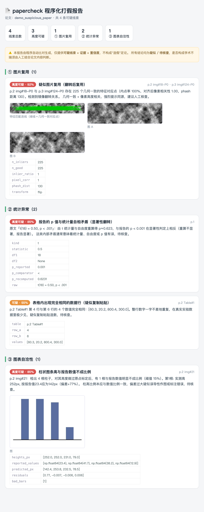

# 耿同学.skill

> **一个耿同学被限流了，千万个耿同学即将到来。**
>
> 一个把"程序化论文打假"做成人人可调用的 **agent skill** 的小工具——向耿同学致敬。

> ⚠️ **请负责任地使用。** 本工具只产出**「可疑线索 + 证据 + 置信度」，措辞一律"疑似/待核查"，
> 绝不构成"造假"定论**。它的程序层是**高召回、低精度**的候选生成器，**务必人工复核**
> （或开 `--judge` 让 LLM 协助分流），**切勿据此公开指控任何人**。是否构成学术不端，由人判断。

## 缘起

其实我做这个，本不是为了打假。

我先做了一套 **AI for Science** 系统：它替你通读某个科学领域的论文，把这门学科的**整体地图**和
**最前沿**呈现出来，免得大家面对浩瀚文献只能管中窥豹、盲人摸象。

可偏偏在我比较聚焦的**生命科学**领域，耿同学挖出了大量虚假论文——这让我很难受。我怕把这些
本该"束之高阁"的论文引入凡尘、端到每个人面前时，反而让大家头上落了一层"灰"。于是我悄悄给系统
加了一个**「找出可能造假的论文」**的功能；它本是 AI for Science 系统的一个组件，已经在跑了。

耿同学让我看到：很多造假，靠形式化比对就能抓出来，不必读懂内容。受他启发，我把这个功能单独拎出来、
包装成 **`耿同学.skill`** 公开出来——**作为一点小小的致敬**。

## 它能做什么

当然，它**远不如耿同学厉害**，只是个**初筛辅助**。它实现了这些检测器：

- 🖼 **图像**：一图多用 · 旋转/翻转/缩放/裁剪后复用 · 单图复制粘贴(copy-move) · 西部印迹拼接缝 · 跨论文盗图 · 复用面板聚类
- 🔢 **数据/统计**：statcheck(p值重算) · GRIM · GRIMMER · SPRITE · 本福特定律 · 末位数字均匀性 · 等差数列 · 跨列固定差值 · 跨记录小数巧合 · 重复数据行
- 📈 **图表**：柱高 vs 报告数值 · 误差棒异常
- 📝 **文本/元数据**：ChatGPT 代写指纹 · tortured phrases(论文工厂) · 引用撤稿论文核查
- 🧠 **语义裁决**：当它作为 skill 被 agent 调用时，**调起它的那个 agent 直接看候选图来判**（真可疑/良性/不确定）——无需外接模型；headless CLI 下才可选外接 LLM

**程序找候选 →（调起它的 agent 看图当判官）→ 人定责。** 程序层输出机读候选(`--json`，含证据图路径)
+ 一份**自包含的 HTML 证据报告**（并排缩略图 + 匹配连线 + 置信度）：



## 安装 / 使用

**作为 agent skill**（推荐）——把它放进你的 agent 的 skills 目录：

```bash
# 解压 耿同学.skill（zip），或克隆本仓库到 <你的agent>/skills/papercheck
#   Claude Code: ~/.claude/skills/papercheck   ·   openclaw / hermes: 各自的 skills 目录
bash <skill目录>/scripts/setup.sh     # 幂等：建独立 venv 装好，不污染你的项目环境
# 重载客户端后，触发 /papercheck <论文.pdf>
```

**作为命令行工具**：

```bash
pip install -e .          # 或 uv pip install -e .
python -m papercheck analyze data/某论文.pdf --judge -o output/
python -m papercheck index data/*.pdf --db fp.db && python -m papercheck cross --db fp.db -o output/
```

**判官是谁？** 作为 skill 被 agent 调用时，**判官就是调起它的那个 agent**（用 `--json` 拿候选 + 证据图路径，
agent 自己看图裁决，零外接）。只有**无 agent 的 headless/批量**或想要**第二意见**时，才用 `--judge` 外接 LLM
（厂商中立：`PAPERCHECK_LLM_CMD='…{prompt} {images}'` 接任意 CLI，或自动探测 claude/codex）。

## 首次做"所有 agent 都能直接用"的 skill，欢迎一起完善

这是我**第一次做"所有 agent 都能直接用"的通用 skill**，也**没在 openclaw 和 hermes 里实际跑过**。
如果你在运行时遇到小 bug，**麻烦让你的 LLM 帮忙修一下、提个 PR**，谢谢！🙏 工具本身就是为"可被任意 agent 修复"而设计的。

## 致敬

- **耿同学**——程序化打假的启发与勇气。本工具向他致敬，与他无任何关联，亦非他本人所作或背书。
- **Elisabeth Bik**——生物医学图片查重方法论。

## License

[MIT](LICENSE)
